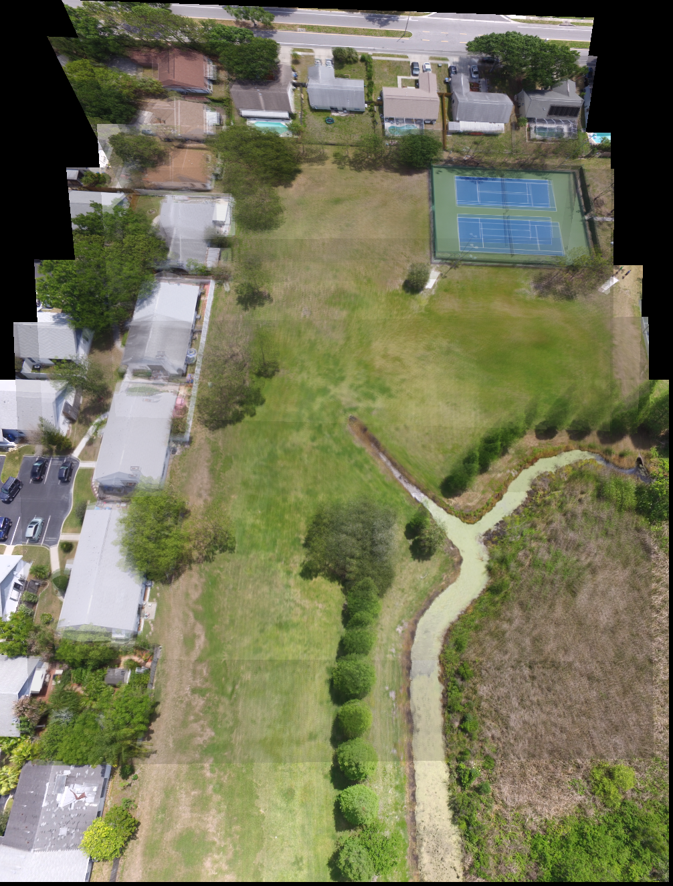
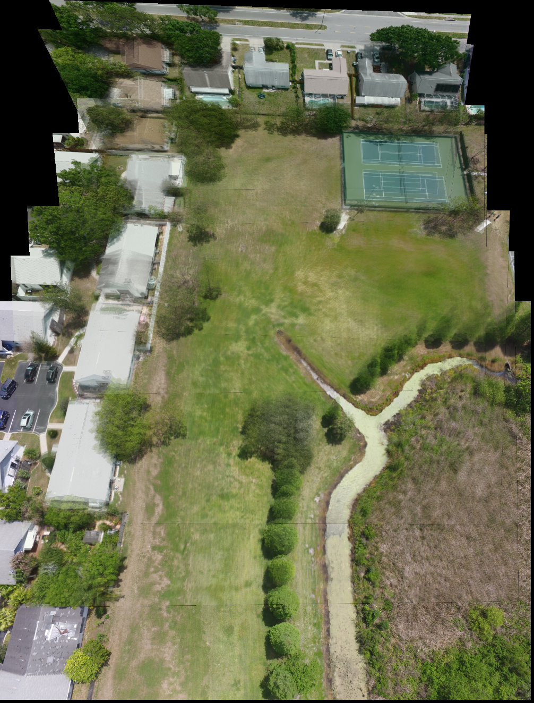

# [Paper Implementation] IMIHM

[English](./README.md) | [中文](./README.zh.md)

IMIHM is a C++/OpenCV implementation of an image-sequence color-correction workflow. The implementation follows the method described in the IEEE paper below and processes an ordered image folder together with precomputed transformation matrices.

## Paper

- Title: A Color Correction Method Based on Incremental Multilevel Iterative Histogram Matching
- IEEE Xplore: https://ieeexplore.ieee.org/document/10614104
- DOI: https://doi.org/10.1109/JSEN.2024.3432277
- Publication: IEEE Sensors Journal, Vol. 24, No. 17, pp. 27892-27901, Sept. 1, 2024

## What This Code Does

The program loads an image sequence and its transformation matrices, performs incremental multilevel iterative histogram matching, and writes corrected images plus warped outputs. The main steps are:

1. Load input images and `3 x 3` transformation matrices.
2. Align adjacent images with the provided homography matrices.
3. Estimate overlap regions and apply histogram-matching based color correction.
4. Propagate the correction across sliced local regions in the target image.
5. Write corrected sequence images and warped images for later mosaic inspection.

## Example Result

| Original mosaic | IMIHM result |
| --- | --- |
|  |  |

## Requirements

- Windows
- CMake 3.20 or newer
- C++17 compiler
- OpenCV 4.10.0 for the default CMake configuration

The project can be built with another OpenCV 4.x installation, but the default `CMakeLists.txt` currently points to OpenCV 4.10.0.

## OpenCV Setup

The default CMake configuration expects OpenCV at:

```text
C:/Program Files/OpenCV/opencv-4.10.0/build/install
```

This path is configured in `CMakeLists.txt`:

```cmake
set(OpenCV_DIR "C:/Program Files/OpenCV/opencv-4.10.0/build/install")
```

If OpenCV is installed somewhere else, update `OpenCV_DIR` before configuring the project.

At runtime, make sure the OpenCV runtime DLLs can be found, either by adding the OpenCV binary directory to `PATH` or by placing the DLLs next to the built executable.

## Build

From the repository root:

```powershell
cmake -S . -B build
cmake --build build --config Release
```

This builds the `IHM` executable in the `build` directory.

## Input Data Layout

`src/main.cpp` expects three command-line arguments:

```text
IHM <Image Folder> <Tfm Matrix Folder> <Number of Image>
```

The included sample input uses this layout:

```text
dataset/
  img/
    IMG_0073.JPG
    IMG_0074.JPG
    ...
  tfm/
    00__H_.txt
    01__H_.txt
    ...
    shape.txt
    shift__H.txt
```

The image folder must contain exactly `Number of Image` images. The transformation matrix folder must contain one `3 x 3` matrix text file for each image, plus `shape.txt` and `shift__H.txt`.

The program sorts file paths before processing them, so keep file names ordered consistently.

Output paths are currently hard-coded in `src/global_folder_paths.cpp`:

```cpp
std::string resultFolder = "C:/Timothy/Code/IHM/result/";
```

Change this path before running if outputs should be written somewhere else.

## Run

After building, run the generated executable with the image folder, transformation matrix folder, and image count:

```powershell
.\build\IHM.exe .\dataset\img .\dataset\tfm 10
```

Corrected outputs are written to:

```text
<result-folder>/org_IHM/
<result-folder>/warped_IHM/
```

Intermediate debug images are written to:

```text
<result-folder>/tmp/
```

## Project Structure

- `src/main.cpp`: command-line parsing and end-to-end image-sequence processing flow.
- `src/ihm.cpp`, `include/ihm.hpp`: incremental multilevel iterative histogram matching flow.
- `src/hm.cpp`, `include/hm.hpp`: histogram calculation, CDF mapping, and color correction utilities.
- `src/loader.cpp`, `include/loader.hpp`: image and transformation-matrix loading.
- `src/util.cpp`, `include/util.hpp`: perspective transformation, overlap estimation, and output-folder cleanup.
- `src/global_folder_paths.cpp`, `include/global_folder_paths.hpp`: hard-coded output directory configuration.
- `dataset/`: sample images and transformation matrices.
- `assets/`: example result images used by this README.

## Copyright Notes

This repository is intended to contain an independent implementation of the paper method. It should not redistribute the IEEE paper PDF, extracted figures, tables, screenshots, or long verbatim passages from the paper unless permission is granted by the rights holder.

The README only provides bibliographic information and links to the IEEE Xplore page/DOI. Before uploading generated images, datasets, or evaluation files, also verify the license or redistribution terms of the source dataset.

No project license file is currently included. If this repository is meant to be open source, add a `LICENSE` file before publishing so downstream users know how the implementation code may be used.
